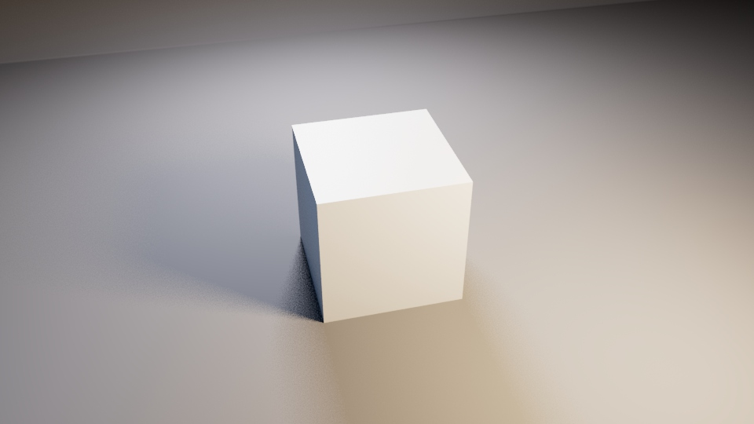

# 🎬 LookDev Studio Pro

**LookDev Studio Pro** es una herramienta de Technical Art procedimental construida en **MEL (Maya Embedded Language)**. Diseñada como el núcleo de estandarización visual y control de calidad (QA) para pipelines de producción 3D y Virtual Production.

Reduce un proceso de setup manual de 15-20 minutos a **un solo clic (< 5 segundos)**, permitiendo a los artistas centrarse en la topología y el texturizado, mientras el script garantiza un entorno de revisión físicamente correcto y matemáticamente seguro para su exportación a motores de juego (UE5 / Unity).

---

## ✨ Características Principales (Core Features)

* **Escalamiento Procedimental Inteligente:** Lee la selección activa del artista para calcular el Bounding Box exacto del asset (con fallback a toda la escena si no hay selección) y genera un ciclorama proporcional a su escala.
* **Iluminación Arnold Nativa:** Instancia un rig de tres luces cinemáticas (`aiAreaLight`) — Key, Fill, Rim — con jerarquía de intensidad correcta (Key 360 > Rim 144 > Fill 24) más un `aiSkyDomeLight` de ambiente. Todos los tipos de luz cuentan con guard de plugin `mtoa` y fallback a luces nativas de Maya.
* **Ciclorama Shadow Catcher:** El ciclorama usa `aiShadowMatte` con `backgroundColor` RGB 0.596 — color de fondo exacto e independiente de la iluminación, sin gradientes ni variaciones por posición de luces. El asset proyecta sombras perfectas sobre él como si fuera un suelo físico real. Fallback a `lambert` si mtoa no está cargado.
* **Tri-Cam + Ortho Setup Automático:** Genera y encuadra seis cámaras de producción: tres de perspectiva (`CAM_Studio_Main`, `CAM_Studio_Side`, `CAM_Studio_High`) en `CamsPersp_GRP`, y tres ortográficas (`CAM_Ortho_Top`, `CAM_Ortho_Front`, `CAM_Ortho_Side`) en `CamsOrtho_GRP`. Todas apuntadas al centro de masa del objeto mediante `aimConstraint`, encuadradas correctamente via `lookThru` + `viewFit`.
* **Arnold Render Presets:** Tres presets de render de 1-clic — Draft 540p (AA×3), Review 720p (AA×4), Final 1080p (AA×6) — con muestras GI calibradas por nivel. Ajustan resolución y Arnold Render Options en un solo comando.
* **Z-Up Pipeline Ready:** Construcción nativa en coordenadas Z-Up para mantener la consistencia milimétrica con exportaciones a Unreal Engine.
* **Undo de Un Solo Paso:** Todo el setup (~30 nodos) queda envuelto en un `undoInfo` chunk, permitiendo deshacer con un único `Ctrl+Z`.
* **Naming Convention Compliance:** Los nodos del rig respetan la convención `_LGT` definida en `NamingConvention_Guide.md`, pasando el QA check de nomenclatura del pipeline.

---

## 🛡️ Pipeline Integration & Pre-Mortem Defenses

Esta herramienta opera como un **Gatekeeper (Guardián)** pre-integración, diseñada con un enfoque defensivo contra los fallos más comunes de un pipeline:

* **Jerarquía Inmutable:** Crea el grupo central `PhotoStudio_SETUP_GRP` aislando el entorno del asset de producción, permitiendo exportaciones limpias sin residuos en el Outliner.
* **Idempotencia (Safe Mode):** Limpia automáticamente ejecuciones anteriores y nodos huérfanos. Garantiza un entorno de trabajo predecible sin *Name Clashing*.
* **Selección Defensiva:** Respeta la selección activa del artista para el cálculo del bounding box, incluyendo jerarquías grupadas de cualquier profundidad. Si no hay selección, toma todas las mallas de la escena (excluyendo el ciclorama propio del tool).
* **Rig de Luces 3-Point Arnold:** Key / Fill / Rim (`aiAreaLight`) más `aiSkyDomeLight` de ambiente, conectados al `defaultLightSet` via `connectAttr -nextAvailable`. Las luces iluminan exclusivamente al asset — el fondo permanece inafectado por el rig gracias al `aiShadowMatte`.

---

## 🛠️ Decisiones Técnicas Clave

1. **Traversal de Jerarquía Agrupada:**
   `ls -sl -dag -type mesh` no recursa de forma fiable en grupos anidados de múltiples niveles. Se usa `listRelatives -allDescendents -type mesh -ni` sobre la selección, que garantiza el recorrido completo del DAG sin incluir intermediate objects (deformadores, blend shapes, skin clusters) que contaminarían el bounding box.

2. **Validación Pre-Chunk:**
   Toda la validación (detección de mallas, cálculo de bounding box) ocurre **antes** de abrir el `undoInfo` chunk. Si un error ocurre en fase de validación, el chunk nunca se abre y el sistema de undo de la sesión permanece intacto. El chunk solo se abre cuando el entorno está garantizado de construirse sin errores tempranos.

3. **Captura de Selección Antes del Grupo Raíz:**
   `group -empty` selecciona automáticamente el nodo recién creado, pisando la selección original del artista. La selección se captura en `$sel[]` al inicio del procedimiento, antes de cualquier operación de creación de nodos.

4. **`aiShadowMatte` vs `aiStandardSurface` para el ciclorama:**
   Con `aiStandardSurface roughness 1.0`, el color visible del fondo depende de cuánta luz llega a cada punto — las luces del rig crean gradientes inevitables. `aiShadowMatte` desacopla el color del fondo de la iluminación: `backgroundColor` es exactamente lo que se renderiza, sin importar el rig. Además actúa como shadow catcher, mostrando las sombras del asset sobre el fondo de forma física.

5. **Detección de Crease Post-Extrusión:**
   Después de `polyExtrudeEdge`, los índices de arista se reasignan. En lugar de reutilizar el índice `e[3]` (que ya no apunta al crease), se usa `polyListComponentConversion -toEdge -internal` sobre las dos caras resultantes para encontrar siempre la arista interior correcta antes del `polyBevel`. El resultado se valida con `size($creaseEdges) > 0` antes de ejecutar el bevel.

6. **Encuadre de Cámaras (`viewFit`):**
   `viewFit` solo tiene efecto sobre la cámara activa en un panel. El script cicla cada cámara de studio por el viewport activo via `lookThru`, ejecuta el fit, y restaura la cámara original del artista.

7. **Guard de Plugin `mtoa` (cacheado):**
   El resultado de `pluginInfo -q -loaded "mtoa"` se captura una sola vez en `$isMtoa` al inicio del procedimiento. Los tres bloques condicionales que dependen del plugin usan esta variable, eliminando queries repetidas y centralizando la lógica.

8. **Optimización de AimConstraints:**
   Cámaras y luces se unificaron en un único array procesado en bucle, apuntando a un locator temporal. El locator se crea bajo `$mainGroup` para que, en caso de error posterior, sea recogido por la limpieza automática de la siguiente ejecución.

---

## 🚀 Instalación y Uso

**Sin dependencias.** MEL puro. No requiere Python ni plugins externos (solo el plugin nativo `mtoa` para el modo Arnold completo).

1. Abre el **Script Editor** en Autodesk Maya.
2. Pega el código de `/src/LookDevStudioPro.mel`.
3. Selecciona todo el texto y arrástralo a tu *Shelf* para crear un botón.
4. **Ejecución:** Selecciona tu asset en el viewport, presiona el botón y el entorno se generará al instante. Si no hay nada seleccionado, el script tomará todas las mallas de la escena.

<video width="100%" controls>
  <source src="./examples/video/Previewlookdevstudioprov1.0.mp4" type="video/mp4">
  Tu navegador no soporta la etiqueta de video.
</video>

https://github.com/user-attachments/assets/0ce183ec-5260-474c-bce9-671c765813e2

---

## 📁 Documentación Anexa

* [Guía de Nomenclatura y Estructura Work/Publish (TAR-021)](./docs/NamingConvention_Guide.md)
* [Auditoría Técnica v1 — 10 bugs identificados y corregidos (v1.0.1)](./Auditoria.md)

---

## 📋 Changelog

### v1.1.0
- **Nuevo:** Tres cámaras ortográficas (Top, Front, Side) en sub-grupo `CamsOrtho_GRP`, aislado del grupo de perspectiva `CamsPersp_GRP`.
- **Nuevo:** `applyRenderPreset()` — tres presets Arnold de 1-clic con resolución + muestras GI calibradas: Draft 540p, Review 720p, Final 1080p.
- **Nuevo:** Botones de Render Presets integrados en la UI.
- **Fix plausible #7:** `CAM_Ortho_Top` usa `worldUpVector 0 1 0` — su aim es `-Z` exacto, colineal con el worldUp Z-Up; el cambio elimina la singularidad del aimConstraint en esa cámara.
- **Fix plausible #10:** Guard `sets -isMember defaultLightSet` antes de cada `connectAttr` — evita doble conexión en MtoA 4+ que auto-registra `aiAreaLight`.
- **Fix plausible #G4:** `select -r $validMeshes` antes de cada `viewFit` en el loop — previene pérdida de selección por side effects de `lookThru` en ciertos entornos.

### v1.0.5
- **Fix crítico:** Toda la validación movida pre-`undoInfo -openChunk` — un error temprano ya no deja el chunk abierto y corrompe el undo de la sesión.
- **Fix alto:** `listRelatives -allDescendents` ahora pasa `-ni` — intermediate objects (deformadores, blend shapes) excluidos del bounding box.
- **Fix medio:** Guard de array vacío en `$parent[0]` — meshes sin padre ya no pasan silenciosamente al bounding box.
- **Fix medio:** `polyBevel` solo se ejecuta si `$creaseEdges` no está vacío — ciclorama nunca queda con esquina aguda sin error visible.
- **Fix medio:** `Cyclorama_GEO` huérfano eliminado en la limpieza inicial — evita colisión de nombres y renombrado automático a `Cyclorama_GEO1`.
- **Fix menor:** `setAttr backgroundColor` sin `-type double3` — compatible con MtoA < 3.3 donde el atributo es `float3`.
- **Fix menor:** Locator de aim creado bajo `$mainGroup` — no filtra al mundo si falla antes de ser eliminado.
- **Ajuste:** Cámaras renombradas a convención `CAM_` (`CAM_Studio_Main`, `CAM_Studio_Side`, `CAM_Studio_High`) — conformes con `NamingConvention_Guide.md §3`.
- **Cleanup:** `pluginInfo -q -loaded "mtoa"` cacheado en `$isMtoa` — consultado una sola vez por ejecución.
- **Cleanup:** Eliminados todos los prints `[DEBUG]` de producción.
- **Cleanup:** Eliminados comentarios `Bug #X` desactualizados del audit v1.
- **Cleanup:** `-ch 0` en `polyPlane` y `polyExtrudeEdge` — sin historial de construcción en el ciclorama.

### v1.0.4
- **Reemplazo:** `aiStandardSurface` → `aiShadowMatte` en el ciclorama — color de fondo exacto, independiente de la iluminación, con shadow catcher nativo.
- **Eliminado:** BGWash_L/R_LGT — redundantes con `aiShadowMatte`.
- **Ajuste:** Ciclorama expandido a ratio 3:1 (ancho `maxDim*24` × alto `maxDim*8`).
- **Ajuste:** Color del ciclorama actualizado a RGB 0.596.

### v1.0.3
- **Fix:** Selección capturada antes de `group -empty` para evitar que el nodo raíz pise la selección del artista.
- **Fix:** Light linking corregido — `sets -addElement` no acepta transforms como miembro; reemplazado por `connectAttr -nextAvailable` sobre `defaultLightSet.dagSetMembers`.
- **Ajuste:** Intensidades de luces +20% — Key 360 / Fill 24 / Rim 144.
- **Ajuste:** Distancias de luces reducidas ~25% para mayor proximidad al asset.
- **Ajuste:** Posición de cámaras calibrada con asset de referencia (maxDim 6.23) — `Studio_Cam_Side` X 1.5→1.3, `Studio_Cam_High` Z 3.0→1.8.

### v1.0.2
- **Fix:** Detección de mallas en grupos anidados — `ls -sl -dag` reemplazado por `listRelatives -allDescendents -type mesh` para recorrer jerarquías de cualquier profundidad.

### v1.0.1
- **Fix crítico:** Bounding box ahora respeta la selección activa del artista (#1)
- **Fix alto:** Luces principales migradas a `aiAreaLight` nativo de Arnold (#2)
- **Fix alto:** Crease edge del ciclorama identificado correctamente post-extrusión via `polyListComponentConversion` (#3)
- **Fix medio:** `viewFit` de las cámaras de studio funciona via `lookThru` por panel (#4)
- **Fix medio:** Material del ciclorama migrado a `aiStandardSurface` (#5)
- **Fix medio:** Todo el setup envuelto en `undoInfo` chunk — undo de un solo paso (#6)
- **Fix medio:** Jerarquía de intensidades 3-point corregida: Key 300 / Fill 20 / Rim 120 (#7)
- **Fix medio:** Light linking via `sets -addElement` en lugar de `connectAttr` raw (#8)
- **Fix menor:** Luces renombradas a convención `_LGT` según `NamingConvention_Guide.md` (#9)
- **Fix menor:** Guard de plugin `mtoa` aplicado a todas las luces principales (#10)

### v1.0.0
- Release inicial: ciclorama procedimental, rig de 3 luces, tri-cam setup, Z-Up pipeline.

---

## 🗺️ Roadmap y Evolución de la Herramienta (Releases)

Este repositorio se encuentra en desarrollo activo. La arquitectura modular actual en MEL sienta las bases para escalar la herramienta hacia una suite de pipeline completa.

### 📍 Fase 1: Expansión de UI y Render (Ciclo v1.x.x)

- [x] **v1.1.0 (Camera & Render Update):** Generación de vistas ortográficas (Top, Front, Side) aisladas del grupo de perspectiva. Inyección de presets de Arnold Render Settings de 1-clic (Draft 540p, Review 720p, Final 1080p).
- [ ] **v1.2.0 (The MetaHuman UI Update):** Panel visual de presets de estudio. Selectores de temperatura de color (Kelvin) para el light rig. Selector de color difuso para el ciclorama y menús para HDRIs personalizados.

### 📍 Fase 2: Refactorización y Automatización (Ciclo v2.x.x)

- [ ] **v2.0.0 (Python Core Migration):** Traducción del motor lógico a **Python (PyMEL / maya.cmds)** para ejecución en modo *batch*, generando y renderizando estudios para cientos de assets en segundo plano.

### 📍 Fase 3: Ecosistema de Pipeline End-to-End (Ciclo v3.x.x)

- [ ] **v3.0.0 (Smart UV & PBR Ingest):** Integración de corrección de UVs, exportación automática USD/FBX sanitizada, y **Material Auto-Linker** para mapas PBR exportados desde Substance Painter.

---

*Desarrollado por Facundo Villarreal — Lead Cinematic Technical Artist.*
